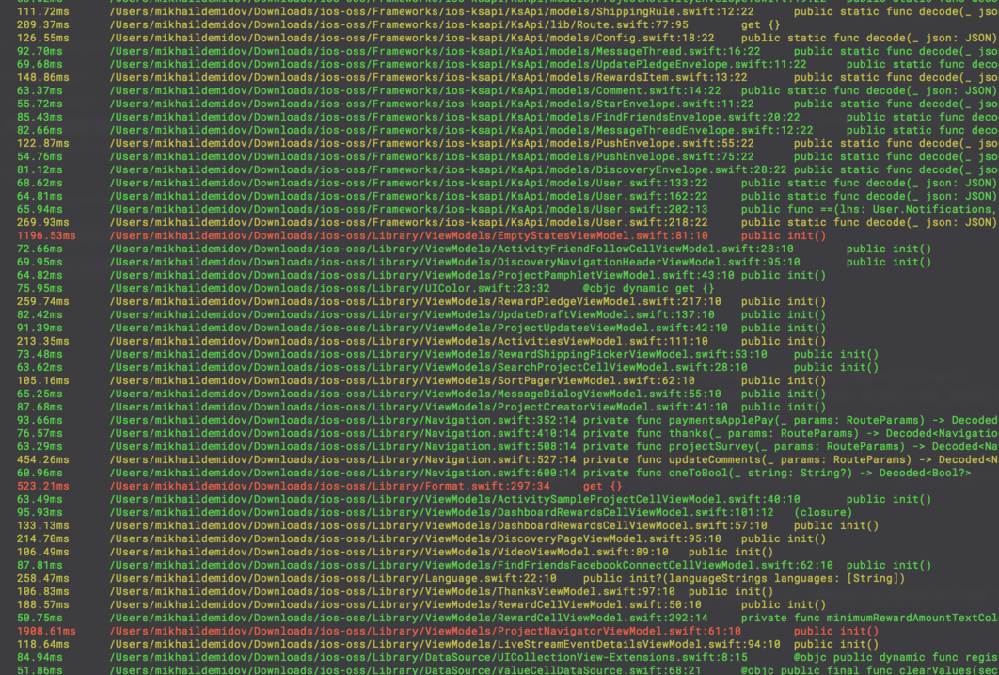

## Swift Compilation Time Profiler

- Find a compilation bottle neck at Swift project of yours

### Req

- Xcode >= 8
- project must have swift files to build

### How it's done?

- it uses "-Xfrontend -debug-time-function-bodies" flag when builds your project

### How to run

```bash
ruby swift_time_profiler.rb args...
```

#### Supported arguments

- -workspace 'your workspace' (required)
- -project 'your project' (required)
- -scheme 'yor project scheme' (required)
- clean, if you want to build from scratch (optional, by default doesn't clean)
- includePods, if you want to profile your Cocoapods dependencies either (optional, by default doesn't do that)

### Example

I've checked this tool on open source project from Kickstarter https://github.com/kickstarter/ios-oss.
Here are some results:

- run

```bash
ruby swift_time_profiler.rb -project Kickstarter.xcodeproj -scheme Kickstarter-iOS clean
```

- part of result


